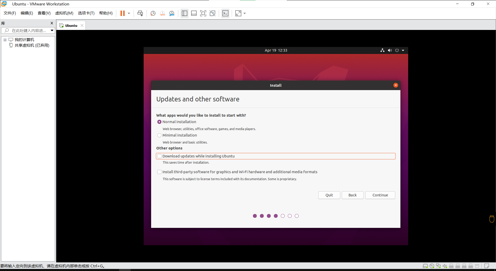
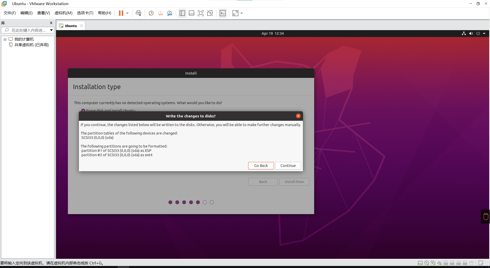

# 4.13考核详细过程 #

## Ubuntu安装 ##

在虚拟机安装中有个问题大家都没有问，感觉还是有点伤心的。在安装过程中，选择了安装镜像后，出现了一个这样的提示在简易安装中，你只需要输入用户名和密码，然后点击开启虚拟机，一切就自动安装好了。就这样简单……吗？</br>

实际上，简易安装潜在的问题挺多的。比如它默认是BIOS启动而不是UEFI启动；比如它默认是USB2.0而不是USB3.0……所以在安装最后一步，一定不要选择“创建后开启虚拟机”。然后我们对于虚拟机的配置以及选项进行修正。</br>

第一部分，我们需要在虚拟机设置里面将启动选项更改成为UEFI，就像下面这样</br>

将启动选项更改为UEFI后，我们还要将USB设置更改成下图这样的设置，这样我们在使用USB设备的时候才不会爆出奇奇怪怪的bug。同时由于我们选择了UEFI启动而不是BIOS启动，所以自动安装需要的软盘和光盘都可以移除了.</br>

在修改完之后并保存了，我们就可以进入虚拟机安装过程了。我相信各位的实力不存在大问题，因此我只会强调一些点。</br>

1. 语言和键盘建议使用English(US)，这样由于语言不兼容导致问题的概率比较小。

2. 在选择完整安装和最小安装时，两者均可以。为了节省安装时间可以选择安装最小系统并取消升级到最新。如果你要在实体机上进行安装，请务必选择第三方驱动。

3. 新手安装时，选择“擦除并安装Ubuntu”就可以了，如果有想要进阶的，可以选择其他模式进行手动分区修正。此外在高级宣子昂中还有一个叫做LVM的东西，希望大家可以自己找一下这是干什么的。

4. 这里记得看清楚默认选项是啥，别选错了

5. 语言和地区选上海。这个是约定俗称的。有的Linux安装过程中还能够选择重庆时间和乌鲁木齐时间，但最好不要选择。此外由于影响力的扩大，现在不少的安装只提供上海时间或者北京时间了。（你问为啥有这些时间？去问刮民党反动派头目常凯申啊）

6. 不要说安装时候没有配置密码了……下图才是正常安装过程中配置密码和机器名的界面！！！！！！！！你选择了简易安装自然这部分是有VMware帮你处理掉的……

7. 最后，安装过程如果耗时过久，你可以在显示“skip”的时候选择跳过来减少安装时间。安装完并重启后的样子是这样的

安装完成后参考[清华镜像站](https://mirrors.tuna.tsinghua.edu.cn/)将镜像源修改成为清华镜像源后进行升级，这部分操作很简单，可以使用[oh-my-tuna](https://tuna.moe/oh-my-tuna/oh-my-tuna.py)简本进行一键替换。</br>

同时，我们安装openssh-server和screen两个软件，因为剩余的部分我们将大量使用命令行进行操作。安装完成后我们就能够在Windows中使用ssh连接到Ubuntu中进行了。安装命令如下</br>

``` $ sudo apt install openssh-server screen -y ```

```$```的含义在Ubuntu的那几篇中间有提到过，含义是一致的</br>
```sudo```的含义在Ubuntu的那几篇中间有提到过，含义是一致的</br>
```apt```的含义在Ubuntu的那几篇中间有提到过，含义是一致的。额外的，```install```指的是进行安装操作，```openssh-server screen```指的是我们要安装的两个软件```-y```指的是在遇到 [Y/n] 时选择 yes 选项。</br>

最终使用Windows Terminal连接到Ubuntu的效果如下</br>
在可以连接后，我们将软件包更新到最新。安装命令如下</br>

``` $ sudo apt update && sudo apt upgrade -y ```

在此不解释命令具体含义，有问题查看[这本书](../book/Linux命令行与shell脚本编程大全Richard_Blum_Christine_Bresn.mobi)</br>

在升级结束后，我们进入lnmp安装过程。</br>

## lnmp安装 ##

lnmp是个啥，可以去看我在文档里面写的内容。在官网上推荐的方法是先使用screen创建一个screen，然后在创建的screen上进行运行，这样可以防止万一终端被关掉后命令仍然可以运行完整。</br>
官网推荐的命令是使用无人值守命令或者这个命令 ```wget http://soft.vpser.net/lnmp/lnmp1.7.tar.gz -cO lnmp1.7.tar.gz && tar zxf lnmp1.7.tar.gz && cd lnmp1.7 && ./install.sh lnmp``` 我们在此不解释每一个命令是啥，但我们这里注意一下，我们可以使用离线安装包进行安装，只需要把命令里的 lnmp1.7.tar.gz 更换成 lnmp1.7-full.tar.gz 即可。</br>
我们安装lnmp的目标是安装WordPress和NextCloud，因此我们需要先去[WordPress官网](https://cn.wordpress.org/download/)和[NextCloud官网](https://docs.nextcloud.com/server/21/admin_manual/installation/system_requirements.html#server)查询最低安装要求。所以我们选择PHP7.4和MySQL8.0</br>
安装结束的页面应该是这样的</br>

## PHPMyAdmin ##

PHPMyAdmin是一种web管理数据库的软件，直接打开以后的页面是这样的</br>
输入用户 "root" 和安装时候输入的root密码就能够登录了。登录后的页面是这样的我们可以看到我们现有的数据库以及数据库版本、nginx版本、PHP版本等信息。</br>
[WordPress官网](https://cn.wordpress.org/download/)和[NextCloud官网](https://docs.nextcloud.com/server/21/admin_manual/installation/installation_wizard.html)在安装指南中都建议使用单独的数据库和数据库用户，所以我们用下图的方式创建对应的用户以及数据库。记得需要 **选中** 创建同名数据库并赋予所有权限。如下图所示即可选中对应复选框后滚轮滚到最下面执行，就可以创建用户和对应数据库了。

## WordPress ##

这里就要说到一个老生常谈的问题了……如果别人向你的网站上传了病毒或者木马，只要不被执行或者执行的用户没有root权限，那么你的系统一般就不会被感染。（注：此处也不一定，因为有各种提权和绕过的手段，在此不做过多解释）查看权限的命令以及更改权限的命令在[这本书](../book/Linux命令行与shell脚本编程大全Richard_Blum_Christine_Bresn.mobi)中奖的很详细，大家可以自行查找阅读相关章节。需要注意的一点是这样的，一般每个文件夹都会有自己的权限码，不是更改了上层目录的权限码子目录的权限码就被更改了。所有者也是同理。因此有时候需要递归的更改，这一点需要注意。</br></br>

在命令行中，我们可以使用 ```wget``` 命令将WordPress的安装包下载到网站目录中并解压。用法参见上文的lnmp安装过程。在解压并且将所有者和权限都修正后，我们就可以参照官网的[这一部分](https://wordpress.org/support/article/how-to-install-wordpress/#step-5-run-the-install-script)来进行安装。

按照官方的操作安装结束后，我们就完成了WordPress的安装。接下来我们来在WordPress存在的前提下安装NextCloud。

## Next Cloud ##

NextCloud是私有云盘的一种开源实现。具体安装和上文概述相同。但除此之外需要额外在NGINX配置文件中修改。NGINX配置文件位于/usr/local/nginx/conf/nginx.conf，需要将其中server里面的include enable-php.conf改成include enable-php-pathinfo.conf，然后重启NGINX即可。</br>
在安装过程中，请将数据库更改成为使用MySQL并设定对应数据库、用户名、密码MySQL端口一般都是3306，这点作为常识大家应该有些了解。

## 总结 ##

WordPress和NextCloud都是简单且经典的PHP应用，有趣但不失实用性。各位可以考虑折腾个低功耗主机装上这两个，当作自己的操作记录。
