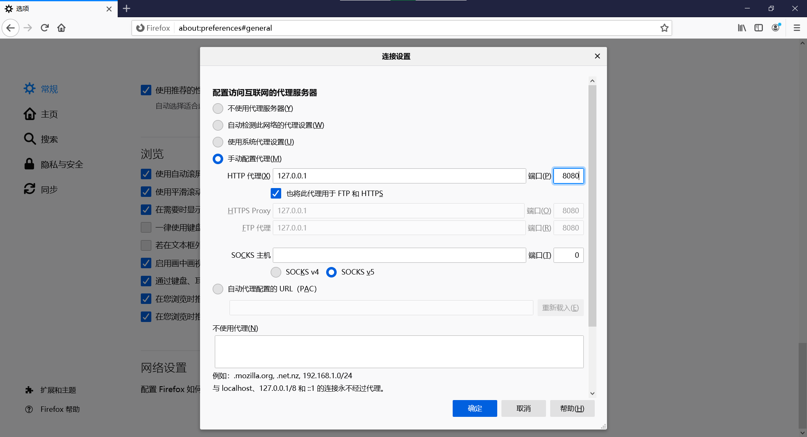
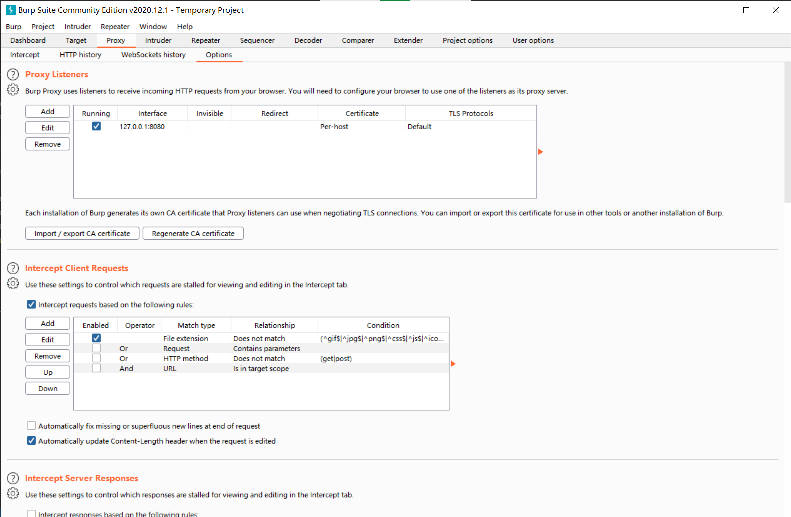
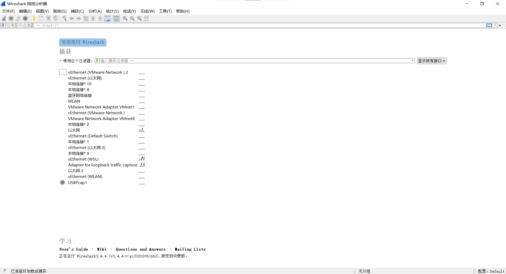
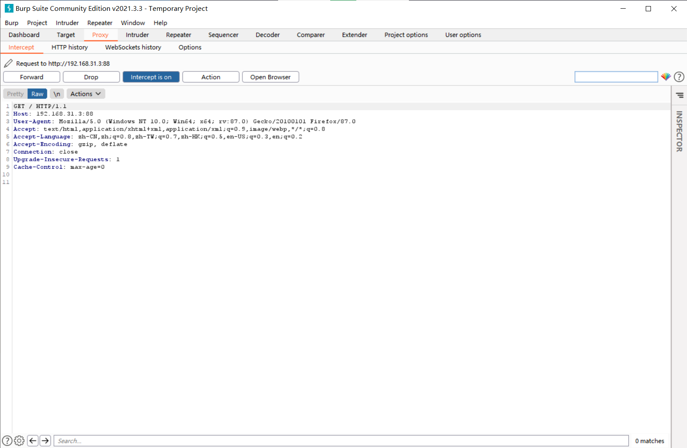

# 网络连接 #

现在我们来解答一个面试常见问题。即，当你在百度的输入框内输入关键词并回车后，发生了什么。 
为了解答这个问题，我们需要几个工具。首先构建访问网站过程的浏览器是必需的。为了分析整个过程，我们需要两种不太一样的抓包软件，分别是[burp suite（以下简称bp）](https://portswigger.net/burp)和[wireshark（以下简称ws）](https://www.wireshark.org/)。为了更加详尽的和更有层次地了解网络连接过程，我们首先要了解这两种网络抓包工具有什么差别。
首先，我们了解什么叫包。我们可以把包看成一个又一个的包裹，从我们的计算机上一个又一个的发给服务器，服务器在收到包裹后又把回应打成一个又一个的包裹发过来。 
在了解了什么是包以后，我们来看一下bp和ws的差别在哪里。简单来讲，bp主要的作用方式是拦截，复制，放送；而ws主要是监听，复制。两者的差别让他们主要分析方向存在了差别。通常情况下我们使用bp进行http的流量分析，而使用ws进行一些不方便处理的分析。在下面的教程中，我们讲粗浅地讲解一下两者的使用。 
对于bp来说，使用时首先需要将浏览器的代理设置成本地代理，端口需要设置成bp监听的端口，接着我们就可以开始抓包了。浏览器设置 bp设置 
对于ws而言，打开ws，选择你要抓包的网卡，点击开始就可以抓包了。 
我们上述的介绍都是初级应用，但对于我们今天的教学足够了。同时，为了简化和网速，我们在这里不去访问百度，而访问我内网建的一个网站。
我们先建立好bp的监听，我们来先学一下最简单的http的连接。在我们输入url并回车后，bp中出现了像下图一样的显示。  
我们可以来分析一下具体内容。 
首先GET表示使用的是GET方法访问链接。还有另一种方法叫做POST，这两者的差别大家先行自行查找学习，后期会出解答。  
接着是HOST，这里通常是你访问网站的域名。这里是我在内网搭建的一个word press。 
User-Agent指的是用户代理，服务器可以通过这里来区分用户的操作系统以及浏览器，为不同的人群提供合适的页面。 
其他的一些头文件以及消息体，均在book文件夹下有[书籍](./book/网络是怎样连接的_户根勤.mobi)可以查询。 
接下来，大家可能听过http的3次连接和4次关闭。为了了解这一部分，我们就需要使用ws了。具体操作可以查看[这本书](./book/Wireshark.mobi)。但同时请注意，此书成书时间较久，如果对于某一部分感兴趣，务必采取合适方法本地复现场景，使用新版本ws进行抓包分析。 
这样，我们就初步了解了怎么建立一个http连接了。同样，在高级教程中，我们将使用ws进行两种常见程度仅次于http协议的协议建立过程，分别是dhcp协议和smb协议。希望大家到时候可以自行分析得到结论。 
